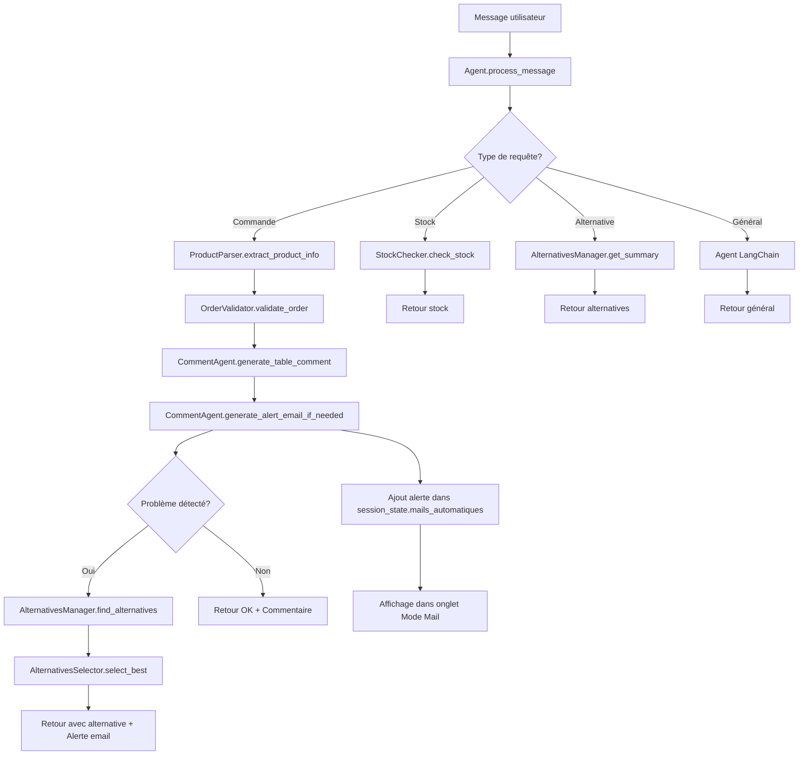

# Architecture Modulaire NINIA
*Version 2.0 - Refactorisée et Optimisée*

## 📋 Table des matières

1. [Vue d'ensemble](#vue-densemble)
2. [Architecture modulaire](#architecture-modulaire)
3. [Module Extraction](#module-extraction)
4. [Module Analysis](#module-analysis)
5. [Module Alternatives](#module-alternatives)
6. [Agent Principal](#agent-principal)
7. [Outils de Debug](#outils-de-debug)
8. [Migration depuis l'ancienne version](#migration-depuis-lancienne-version)
9. [Exemples d'utilisation](#exemples-dutilisation)
10. [Troubleshooting](#troubleshooting)

---

## 🎯 Vue d'ensemble

### Problème résolu
L'ancienne architecture avait **deux agents redondants** avec des fonctionnalités dupliquées, rendant le debugging difficile et la maintenance complexe.

### Solution apportée
**Architecture modulaire** avec séparation claire des responsabilités :
- **ninia/extraction/** : Extraction de produits et quantités
- **ninia/analysis/** : Validation des commandes (stock, marge)
- **ninia/alternatives/** : Gestion des alternatives et sélection LLM
- **ninia/agent.py** : Agent principal unifié

### Avantages
- ✅ **Debugging facilité** : Chaque étape peut être testée indépendamment
- ✅ **Responsabilités claires** : Un module = une fonction précise
- ✅ **Maintenabilité** : Plus de code dupliqué
- ✅ **Performance** : Logique optimisée et consolidée

---

## 🏗️ Architecture modulaire

```
ninia/
├── agent.py                    # 🤖 Agent principal unifié
├── extraction/                 # 🔍 Module d'extraction
│   ├── __init__.py            
│   ├── product_parser.py      # Extraction produits/quantités
│   └── text_extractor.py      # Normalisation et prix
├── analysis/                   # 📊 Module d'analyse
│   ├── __init__.py
│   ├── order_validator.py     # Validation complète des commandes
│   └── stock_checker.py       # Vérifications rapides stock/marge
├── alternatives/               # 🔄 Module d'alternatives
│   ├── __init__.py
│   ├── manager.py             # Gestionnaire principal
│   └── selector.py            # Sélection LLM et règles
└── comments/                   # 💬 Module de commentaires + alertes ⭐ NOUVEAU
    ├── __init__.py
    ├── comment_agent.py       # Agent génération commentaires + emails d'alerte
    └── comment_templates.py   # Templates commentaires + mails commerciaux
```

### Flux de traitement



---

## 💬 Module Comments & Alertes ⭐ NOUVEAU

**Responsabilité** : Génération intelligente de commentaires pour les tableaux de commandes + système d'alertes email automatiques pour l'équipe commerciale.

### Classes principales

#### `CommentAgent`
```python
from ninia.comments.comment_agent import CommentAgent

# Initialisation avec LLM existant ou clé API
comment_agent = CommentAgent(llm=existing_llm)
# ou
comment_agent = CommentAgent(api_key="your_api_key")

# Génération automatique intelligente
comment = comment_agent.generate_smart_comment(commande_info, comment_type="auto")
# Résultat : "Commande validée - Stock et marge conformes"

# Génération d'alertes email automatiques
email_content = comment_agent.generate_alert_email_if_needed(commande_info)
# Résultat : Mail d'alerte si problème détecté (stock/marge)
```

**Méthodes de commentaires :**
- `generate_smart_comment(context_info, comment_type)` : Génération intelligente
- `generate_order_comment(commande_info)` : Commentaires de commandes
- `generate_stock_alert_comment(produit_info)` : Alertes de stock
- `generate_margin_comment(marge_info)` : Analyses de marges
- `generate_alternative_comment(alternative_info)` : Suggestions d'alternatives
- `debug_comment_generation(context_info)` : Debug complet

**Nouvelles méthodes d'alertes email :**
- `generate_commercial_alert_email(alerte_info)` : Mails d'alerte généralistes
- `generate_stock_alert_email(rupture_info)` : Mails de rupture de stock
- `generate_margin_alert_email(marge_info)` : Mails de marge insuffisante
- `generate_alert_email_if_needed(commande_info)` : Détection auto + génération

#### `CommentTemplates`
```python
from ninia.comments.comment_templates import CommentTemplates

templates = CommentTemplates()

# Récupérer un template spécialisé
prompt = templates.get_order_analysis_prompt(commande_info)
prompt = templates.get_stock_alert_prompt(produit_info)
```

### Types de commentaires et alertes supportés

#### Commentaires pour tableaux
| Type | Description | Exemple de sortie |
|------|-------------|-------------------|
| **order** | Analyse complète de commande | "Commande validée - Stock et marge conformes" |
| **stock_alert** | Alerte de rupture | "ALERTE STOCK - Rupture totale - Commander immédiatement" |
| **margin** | Analyse de rentabilité | "Marge insuffisante - Vente non rentable" |
| **delivery** | Analyse des délais | "Livraison possible dans les délais" |
| **alternative** | Suggestion de remplacement | "Alternative disponible - Caisse renforcée - Stock : 250" |
| **product** | Description générale | "Emballage carton - Stock: 150 unités - Prix: 8,50€" |

#### Emails d'alerte automatiques ⭐ NOUVEAU
| Type | Déclencheur | Exemple d'objet |
|------|-------------|-----------------|
| **stock_alert_email** | Stock insuffisant | "🚨 Rupture de stock critique - CAISSE US SC 200X140X140MM" |
| **margin_alert_email** | Marge < 15% | "💰 Marge insuffisante - Négociation requise" |
| **commercial_alert_email** | Problème général | "⚠️ Commande problématique - Action requise" |

### Détection automatique intelligente

Le CommentAgent détecte automatiquement le type de commentaire approprié :

```python
# Commande avec quantité → type "order"
commande_info = {
    'nom_produit': 'CAISSE US SC 450X300X230MM',
    'quantite_demandee': 300,
    'stock_suffisant': True,
    'marge_suffisante': True
}

# Détection auto + génération
comment = agent.generate_smart_comment(commande_info, "auto")
# → "Commande validée - Stock et marge conformes"
```

### Intégration dans le chatbot

Le module est automatiquement intégré dans l'agent principal NINIA :

```python
# Dans l'agent principal
from ninia.agent import NiniaAgent

agent = NiniaAgent(api_key=api_key)

# Utilisation directe pour les tableaux
commentaire = agent.generate_table_comment(commande_info, comment_type="order")
```

### 📧 Système d'alertes email ⭐ NOUVEAU

#### Fonctionnement automatique

```python
# Détection et génération automatique d'alertes
commande_info = {
    'nom_produit': 'CAISSE US SC 200X140X140MM',
    'quantite_demandee': 6000,
    'stock_magasin': 4000,          # Stock physique réel
    'stock_a_recevoir': 1000,       # En cours de réapprovisionnement
    'commandes_a_livrer': 2000,     # Déjà alloué à d'autres clients
    'stock_disponible': 3000,       # Calcul automatique : 4000 + 1000 - 2000
    'marge_calculee': 120.50,
    'marge_minimum': 450.00,
    'nom_client': 'Client_IA butterfly'
}

# Le système détecte automatiquement les problèmes et génère les alertes
alert_email = comment_agent.generate_alert_email_if_needed(commande_info)
```

#### Types d'alertes générées

1. **Alerte rupture de stock** : Quand `stock_disponible < quantite_demandee`
   - Affiche le stock physique réel, les réapprovisionnements en cours
   - Calcule exactement le manque : `quantite_demandee - stock_disponible`
   - Propose des actions : livraison partielle ou attendre réapprovisionnement

2. **Alerte marge insuffisante** : Quand `marge_calculee < marge_minimum`
   - Analyse financière détaillée avec calculs précis
   - Suggestions de négociation et prix minimum acceptable
   - Impact sur la rentabilité de la commande

3. **Alerte commerciale générale** : Pour autres problèmes
   - Synthèse de tous les éléments problématiques
   - Actions recommandées pour l'équipe commerciale

#### Correction des données de stock

⚠️ **Important** : Les templates ont été corrigés pour utiliser les vraies données :

```python
# Avant (INCORRECT - affichait toujours 0)
stock_actuel = rupture_info.get('stock_actuel', 0)

# Après (CORRECT - données réelles)
stock_magasin = rupture_info.get('stock_magasin', 0)           # Stock physique
stock_a_recevoir = rupture_info.get('stock_a_recevoir', 0)     # Réapprovisionnement
commandes_a_livrer = rupture_info.get('commandes_a_livrer', 0) # Déjà alloué
stock_disponible = rupture_info.get('stock_disponible', 0)     # Net disponible
```

#### Intégration dans l'interface Streamlit

Les alertes apparaissent dans l'onglet **📧 Mode Mail** avec :

- **🚨 Alertes critiques** : Bordure rouge, priorité haute
- **📧 Communications** : Emails normaux
- **Compteurs séparés** : Alertes vs communications classiques
- **Statistiques mises à jour** : Nombre d'alertes critiques en temps réel

### Avantages du module

- ✅ **Templates spécialisés** : Prompts optimisés pour chaque contexte
- ✅ **Détection automatique** : Intelligence du type de commentaire requis
- ✅ **Fallback robuste** : Commentaires de secours en cas d'erreur LLM
- ✅ **Debug complet** : Outils de test et validation intégrés
- ✅ **Modularité** : Séparation claire des responsabilités
- ✅ **Alertes automatiques** : Détection et génération d'emails d'alerte
- ✅ **Données correctes** : Templates corrigés avec vraies valeurs de stock
- ✅ **Interface intégrée** : Affichage des alertes dans le chatbot

---

## 🔍 Module Extraction

**Responsabilité** : Extraire produits, quantités et prix depuis le texte utilisateur.

### Classes principales

#### `ProductParser`
```python
from ninia.extraction.product_parser import ProductParser

parser = ProductParser()
product_id, quantity, price = parser.extract_product_info(
    "76000 00420000 CAISSE US SC 450X300X230MM Qté 300 Prix : 0,7€"
)
# Résultat : ("76000 00420000", 300, 0.7)
```

**Méthodes clés :**
- `extract_product_info(message)` : Extraction complète
- `debug_extraction(message)` : Debug pas à pas
- `_extract_by_exact_id(message)` : Recherche par ID exact (prioritaire)
- `_extract_by_product_name(message)` : Fallback par nom

#### `TextExtractor` (fonctions utilitaires)
```python
from ninia.extraction.text_extractor import normalize_text, extract_price_from_message

# Normalisation
text = normalize_text("Caisse Américaine àèçñ")
# Résultat : "caisse americaine aecn"

# Extraction prix
price = extract_price_from_message("Je veux 200 caisses à 15€")
# Résultat : 15.0
```

### Formats supportés

| Format | Exemple | ID extrait | Quantité | Prix |
|--------|---------|------------|----------|------|
| **ID exact** | `76000 00420000 CAISSE Qté 300 Prix : 0,7€` | ✅ | ✅ | ✅ |
| **Commande classique** | `Je veux 200 caisses à 15€` | ❌ | ✅ | ✅ |
| **Avec nom produit** | `Film étirable 20µm Qté 100` | ⚠️ | ✅ | ❌ |

⚠️ **Important** : L'ID exact est **prioritaire** et plus fiable que la recherche par nom.

---

## 📊 Module Analysis

**Responsabilité** : Validation des commandes (stock, marge, faisabilité).

### Classes principales

#### `OrderValidator`
```python
from ninia.analysis.order_validator import OrderValidator

validator = OrderValidator()
result = validator.validate_order("76000 00420000", 300, 0.7)

print(result.status)    # "OK", "ATTENTION", "REFUSED", "ERROR"
print(result.message)   # Message détaillé
print(result.analysis)  # Détails de l'analyse
```

**Statuts de validation :**
- ✅ **OK** : Commande réalisable
- ⚠️ **ATTENTION** : Problèmes mineurs (ex: stock limite)
- ❌ **REFUSED** : Problèmes bloquants (marge insuffisante)
- 🚫 **ERROR** : Erreur technique

#### `StockChecker` (fonctions rapides)
```python
from ninia.analysis.stock_checker import check_stock, check_margin, quick_availability_check

# Vérification stock rapide
result = check_stock("76000 00420000")
print(result["message"])

# Vérification marge
result = check_margin("76000 00420000", proposed_price=15.0)
print(f"Marge suffisante: {result['marge_suffisante']}")

# Disponibilité ultra-rapide
available = quick_availability_check("76000 00420000")
print(f"Disponible: {available}")
```

### Logique de validation

1. **Vérification existence** → Produit existe dans l'inventaire ?
2. **Analyse stock** → Stock disponible ≥ quantité demandée ?
3. **Analyse marge** → Marge actuelle ≥ marge minimum ?
4. **Analyse délais** → Compatible avec les délais ?
5. **Statut final** → Synthèse et recommandations

---

## 🔄 Module Alternatives

**Responsabilité** : Recherche et sélection intelligente d'alternatives.

### Classes principales

#### `AlternativesManager`
```python
from ninia.alternatives.manager import AlternativesManager

manager = AlternativesManager(llm_client)

# Recherche alternatives
result = manager.find_alternatives_for_order("76000 00420000", 300)
print(f"Status: {result['status']}")
print(f"Alternatives trouvées: {len(result['alternatives'])}")

# Résumé formaté
summary = manager.get_alternatives_summary("76000 00420000", 300)
print(summary)
```

#### `AlternativesSelector`
```python
from ninia.alternatives.selector import select_best_alternative

# Sélection intelligente
selection = select_best_alternative(
    original_product=product_info,
    alternatives=alternatives_list,
    llm_client=llm,
    selection_criteria=["stock", "marge", "similarité technique"]
)

print(f"Sélection: {selection['selected']['name']}")
print(f"Raison: {selection['reason']}")
print(f"Confiance: {selection['confidence']}")
```

### Méthodes de sélection

1. **LLM intelligent** : Analyse technique approfondie avec prompts optimisés
2. **Règles de fallback** : Scoring automatique si LLM indisponible
3. **Filtrage** : Élimination des alternatives incompatibles
4. **Critères** : Stock, marge, similarité technique, délais

---

## 🤖 Agent Principal

**Fichier** : `ninia/agent.py`

### Initialisation
```python
from ninia.agent import NiniaAgent

agent = NiniaAgent(api_key="your_openai_key")
```

### Méthodes principales

#### `process_message()` - Point d'entrée principal
```python
response = agent.process_message("76000 00420000 CAISSE Qté 300 Prix : 0,7€")
```

**Détection automatique du type de requête :**
- 🛒 **Commande** : Contient ID, quantité, prix
- 📦 **Stock** : Mots-clés "stock", "disponible", "dispo"
- 🔄 **Alternatives** : Mots-clés "alternative", "remplacement"
- 💬 **Général** : Questions, conversations

#### Méthodes spécialisées
```python
# Vérification stock
agent.verifier_stock("76000 00420000")

# Analyse commande
agent.analyser_commande("76000 00420000 CAISSE Qté 300 Prix : 0,7€")

# Recherche alternatives
agent.rechercher_alternatives("76000 00420000")
```

### Outils LangChain intégrés

L'agent dispose de 4 outils LangChain :
1. `verifier_stock` : Vérification de stock
2. `analyser_commande` : Analyse complète de commande
3. `rechercher_alternatives` : Recherche d'alternatives
4. `recherche_documents` : Recherche dans la base de connaissances

---

## 🔧 Outils de Debug

### Debug par module

#### Extraction
```python
debug_info = agent.debug_extraction("76000 00420000 CAISSE Qté 300 Prix : 0,7€")

print("Étapes d'extraction:")
for step, value in debug_info.items():
    print(f"  {step}: {value}")
```

**Sortie type :**
```json
{
    "message_original": "76000 00420000 CAISSE Qté 300 Prix : 0,7€",
    "price_found": 0.7,
    "message_after_price_cleaning": "76000 00420000 CAISSE Qté 300",
    "exact_id_found": "76000 00420000",
    "product_name_found": null,
    "quantity_found": 300,
    "final_result": ["76000 00420000", 300, 0.7]
}
```

#### Validation
```python
debug_info = agent.debug_validation("76000 00420000", 300, 0.7)

print("Étapes de validation:")
for step, result in debug_info["steps"].items():
    print(f"  {step}: {result}")
```

#### Alternatives
```python
debug_info = agent.debug_alternatives("76000 00420000", 300)

print("Recherche d'alternatives:")
print(f"  Alternatives trouvées: {debug_info['steps']['fetch_docs']['alternatives_found']}")
print(f"  Après filtrage: {debug_info['steps']['filtering']['after']}")
```

### Méthode de debug systématique

1. **Identifier le problème** → Quelle étape échoue ?
2. **Isoler le module** → Tester le module spécifique
3. **Analyser les données** → Vérifier les inputs/outputs
4. **Corriger** → Modifier la logique ou les données

---

## 🔄 Migration depuis l'ancienne version

### Fichiers supprimés
- ❌ `app_streamlit/agent.py` (redondant)
- ❌ `ninia/order_analysis.py` (migré vers `analysis/`)
- ❌ `ninia/extraction.py` (migré vers `extraction/`)
- ❌ `ninia/technical_selection.py` (migré vers `alternatives/`)

### Changements d'imports

**Ancien :**
```python
from app_streamlit.agent import NINIAAgent
from ninia.extraction import _extract_product_and_quantity_from_string
from ninia.order_analysis import analyser_commande
```

**Nouveau :**
```python
from ninia.agent import NiniaAgent
from ninia.extraction.product_parser import ProductParser
from ninia.analysis.order_validator import OrderValidator
```

### Interface Streamlit

**Aucun changement** dans `app_streamlit/chatbot_ninia.py` - l'interface reste identique pour l'utilisateur final.

---

## 💡 Exemples d'utilisation

### Exemple 1 : Commande simple
```python
agent = NiniaAgent(api_key)

# Commande avec ID exact (format recommandé)
response = agent.process_message("76000 00420000 CAISSE US SC 450X300X230MM Qté 300 Prix : 0,7€")
print(response)
# → "✅ 76000 00420000 : OK - Quantité: 300, Prix: 0.70€"
```

### Exemple 2 : Debugging d'une extraction qui échoue
```python
# Si l'extraction ne fonctionne pas
message = "Je veux des caisses"
debug = agent.debug_extraction(message)

if not debug["exact_id_found"]:
    print("❌ Aucun ID exact trouvé")
    print("💡 Utiliser le format : 'ID_PRODUIT DESCRIPTION Qté QUANTITÉ Prix : PRIX€'")
```

### Exemple 3 : Validation avec alternatives
```python
# Commande avec problème de stock
response = agent.process_message("76000 00420000 CAISSE Qté 1000 Prix : 0,7€")

if "STOCK INSUFFISANT" in response:
    # Rechercher des alternatives
    alternatives = agent.rechercher_alternatives("76000 00420000")
    print(f"Alternatives disponibles:\n{alternatives}")
```

### Exemple 4 : Vérification stock rapide
```python
# Vérification avant commande
stock_result = agent.verifier_stock("76000 00420000")
print(stock_result)

if "disponibles" in stock_result:
    # Procéder à la commande
    commande = agent.analyser_commande("76000 00420000 CAISSE Qté 100 Prix : 0,7€")
    print(commande)
```

---

## 🚨 Troubleshooting

### Problème : "Produit non trouvé"

**Symptômes :**
```
❌ Produit 'Film étirable' non trouvé dans l'inventaire
```

**Solutions :**
1. **Utiliser l'ID exact** : `76000 00420000` au lieu du nom
2. **Vérifier l'orthographe** : Nom exact dans l'inventaire
3. **Debug extraction** : `agent.debug_extraction(message)`

### Problème : "Quantité invalide"

**Symptômes :**
```
❌ Quantité invalide ou manquante. Veuillez préciser la quantité.
```

**Solutions :**
1. **Format Qté** : `Qté 300` ou `300 unités`
2. **Éviter les mots techniques** : `20µm` peut perturber l'extraction
3. **Debug extraction** : Vérifier `quantity_found`

### Problème : "Marge insuffisante"

**Symptômes :**
```
❌ Marge insuffisante (actuelle: 0.20€, minimum: 0.50€)
```

**Solutions :**
1. **Augmenter le prix** : Proposer un prix plus élevé
2. **Chercher alternatives** : `agent.rechercher_alternatives(product_id)`
3. **Debug validation** : Analyser les marges calculées

### Problème : "Aucune alternative trouvée"

**Symptômes :**
```
❌ Aucune alternative trouvée pour [produit]
```

**Solutions :**
1. **Vérifier l'ID** : Produit existe dans la base ?
2. **Élargir la recherche** : Essayer avec des termes plus génériques
3. **Debug alternatives** : `agent.debug_alternatives(product_id, quantity)`

### Problème : LLM ne répond pas

**Symptômes :**
```
⚠️ Sélection LLM échouée, fallback sur règles
```

**Solutions :**
1. **Vérifier la clé API** : OpenAI API key valide ?
2. **Connexion réseau** : Internet accessible ?
3. **Fallback actif** : Le système continue avec des règles automatiques

---

## 📚 Ressources complémentaires

### Documentation connexe
- [Core RAG](./core.md) : Système de récupération de documents
- [Retrieval](./retrieval.md) : Mécanismes de recherche
- [Gestion ruptures](./gestion_ruptures.md) : Gestion des stocks épuisés

### Format recommandé pour les commandes
```
[ID_PRODUIT] [DESCRIPTION] Qté [QUANTITÉ] Prix : [PRIX]€

Exemples :
- 76000 00420000 CAISSE US SC 450X300X230MM Qté 300 Prix : 0,7€
- 76001 00500000 FILM ETIRABLE 20UM Qté 50 Prix : 15€
```

### Bonnes pratiques
1. **Toujours utiliser l'ID exact** quand disponible
2. **Tester avec debug** avant de déployer des modifications
3. **Vérifier les logs** pour identifier les problèmes
4. **Utiliser les alternatives** en cas de stock insuffisant
5. **Maintenir la base de données** produits à jour

---

*Documentation générée le : `date +%Y-%m-%d`*  
*Version architecture : 2.0*  
*Dernière mise à jour : Refactoring modulaire complet* 